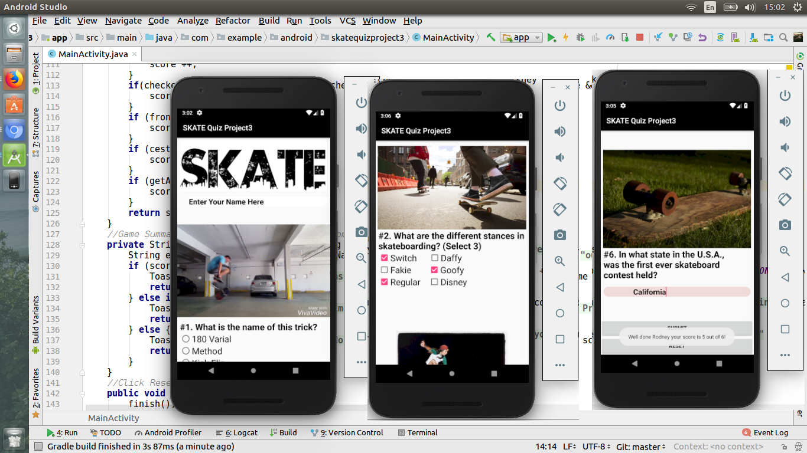

# SKATEQuizProject3
This project was based on Udacity's Android Developers Beginner Program. Initially i was unable to implement the video player in the way i had liked so i created another Quiz App. I later went back to create my original vision of the app. The specifications of this project were:

 - App contains 4-10 questions, including at least one check box, one radio button, and one text entry.
 
 - Questions are in a variety of formats such as free text response, check boxes, and radio buttons.
 
 - Include a button for the user to submit their answers and receive a score
 

